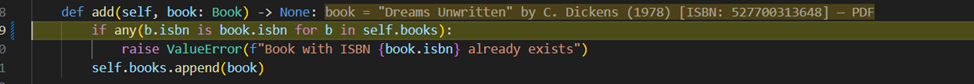
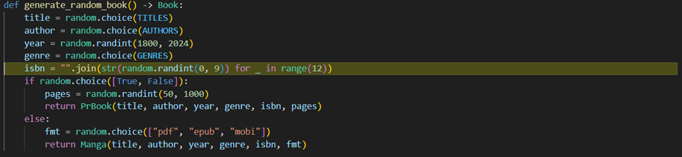
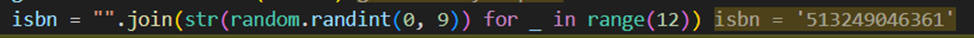
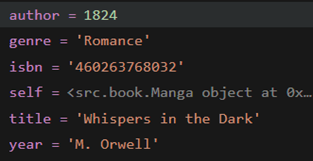
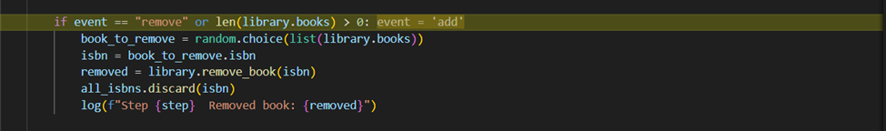
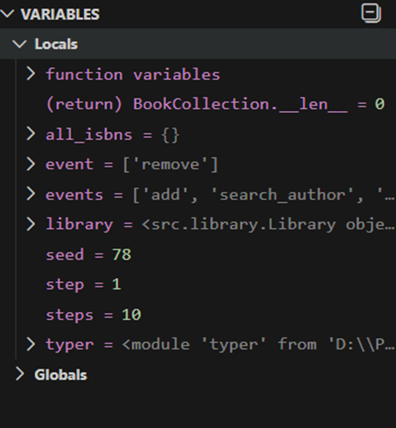
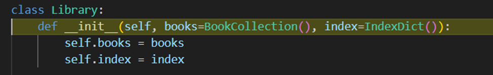
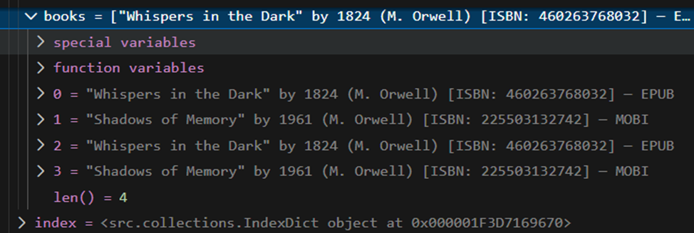

Лабораторная работа №5  
Отладка проекта с намеренно внесёнными ошибками

Проект: модифицированная версия лабораторной работы №4 («Библиотека»).  
Цель: внедрить 5 типовых ошибок, найти их с помощью отладчика, исправить и задокументировать.

Внесённые ошибки
В проект были намеренно добавлены следующие ошибки:

Ошибка 1 — Сравнение через `is` вместо `==`

- Тип ошибки: `is` вместо `==`
- Место: `src/collections.py`, строка в методе `add`
- Симптомы: книги с одинаковым ISBN считаются разными следовательно возможны дубликаты
- Воспроизведение: добавить две книги с одинаковым ISBN → вторая не отклоняется
- Исправление: заменить ` b.isbn is book.isbn` на ` b.isbn == book.isbn`

 
 
Ошибка 2 — Неверная логика в генерации ISBN

- Тип ошибки : НЕверная лоика генерации
- Место: `src/simulation.py`, функция `generate_random_book()`, строка с `range(12)`
- Симптомы: все ISBN содержат 12 цифр вместо 13
- Воспроизведение: любой запуск  в логе ISBN короче стандарта
- Исправление: заменить `range(12)` → `range(13)`

 
 
Ошибка 3 — Перепутаны аргументы функции, Логическая 
- Тип ошибки : Логическая
- Место: `src/simulation.py`, функция `generate_random_book()`, строка с `range(12)`
- Симптомы: Не раблотает поиск по автору и году
- Воспроизведение: любой запуск
- Исправление: поменять местами `author` с `year`

 

Ошибка 4 — Неверное логическое условие (`or` вместо `and`)

- Тип ошибки: неверное логическое условие
- Место: `src/simulation.py`, условие удаления книги
- Симптомы: попытка удалить книгу из пустой библиотеки → `IndexError`
- Воспроизведение: `seed`, при котором первое событие — `remove`, а библиотека пуста
- Исправление: заменить `or` → `and`

 
 
BookCollection.__len__ = 0 но мы заходим в условие из-за неправильного условия

Ошибка 5 — Использование изменяемого значения по умолчанию

- Тип ошибки: изменяемое значение по умолчанию
- Место: `src/library.py`, `__init__(self, books=None, index=None)`
- Симптомы: две библиотеки делят одно состояние - книги сохраняются между сессиями
- Воспроизведение: запустить `run_simulation()` дважды подряд - вторая сессия начинается с книг из первой
- Исправление: использовать `books if books is not None else BookCollection()`
 

 
 
